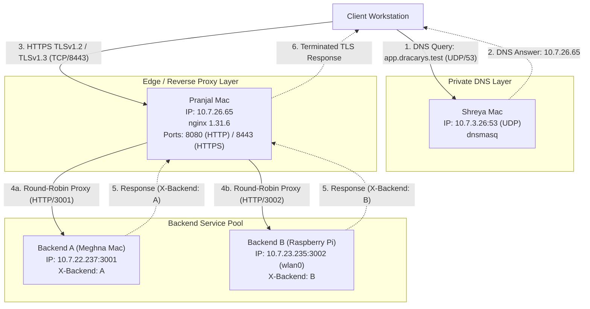

# System Architecture Document

**Project**: Private Network Service Platform  
**Team**: Dracarys  
**Phase**: Phase 1 Final Submission  

---

## 1. Project Overview

The **Private Network Service Platform** is an enterprise-grade private network infrastructure designed and deployed across multiple physical nodes on a local area network. It demonstrates core computer networking principles across the application, transport, and network layers:
- **Private Domain Name Resolution**: Internal domain `app.dracarys.test` resolved via an isolated, authoritative `dnsmasq` server.
- **Edge Reverse Proxy & TLS Termination**: An `nginx` instance handling secure HTTPS traffic (port 8443) and plaintext HTTP (port 8080) with a custom Public Key Infrastructure (PKI) local Certificate Authority.
- **Load Balancing**: Upstream round-robin distribution of application requests across heterogeneous backend systems (macOS and Raspberry Pi Linux).
- **HTTP Semantics & Caching**: Standardized RESTful endpoints supporting `GET` and `HEAD` methods, cache freshness via `Cache-Control`, and conditional revalidation via `ETag` and `If-None-Match` generating `304 Not Modified` responses.
- **Network Observability & Fault Tolerance**: In-depth packet analysis with Wireshark and verified failure resilience under diverse fault injection scenarios.

---

## 2. Machine & Service Inventory

| Role | Machine / Node | Host OS / Device | IP Address | Interface | Port(s) | Service / Daemon | Source / Configuration Path |
| :--- | :--- | :--- | :--- | :--- | :--- | :--- | :--- |
| **DNS Server** | Shreya Mac | macOS | `10.7.3.26` | `en0` | UDP/53, TCP/53 | `dnsmasq` | `dns/dnsmasq.conf` |
| **Edge / Load Balancer** | Pranjal Mac | macOS | `10.7.26.65` | `en0` | 8080 (HTTP), 8443 (HTTPS) | `nginx 1.31.6` | `nginx/nginx.conf` |
| **Backend A** | Meghna Mac | macOS | `10.7.22.237` | `en0` | 3001 (HTTP) | Python 3 HTTPServer | `~/CN_Project/backend-a/server.py` |
| **Backend B** | Raspberry Pi | Raspberry Pi OS | `10.7.23.235` | `wlan0` | 3002 (HTTP) | Python 3 HTTPServer | `~/CN_Project/backend-b/server.py` |

---

## 3. Network Addressing & Topology

All participating machines reside within the same campus/private IPv4 subnet:
- **Subnet Prefix**: `/19` (Netmask: `255.255.224.0`, supporting host IPs from `10.7.0.1` to `10.7.31.254`)
- **Default Gateway**: `10.7.0.1`
- **Private Domain**: `app.dracarys.test` (and `api.dracarys.test`)

Because all nodes share the `/19` prefix, intra-node communication between the client, DNS resolver, edge proxy, and backend servers occurs within the broadcast domain via Layer 2 (Ethernet/802.11) ARP and direct IP routing without crossing intermediate NAT gateways.

---

## 4. Architecture Diagram



---

## 5. DNS Architecture

DNS resolution is handled by `dnsmasq` running on Shreya's Mac (`10.7.3.26`).

- **Configuration File**: `dns/dnsmasq.conf`
- **Listening Interfaces & Addresses**:
  - `listen-address=127.0.0.1,10.7.3.26`
  - `interface=en0`
- **Authoritative Static Mappings**:
  - `app.dracarys.test -> 10.7.26.65`
  - `api.dracarys.test -> 10.7.26.65`
- **Behavior**:
  When a client makes a standard DNS `A` query over UDP port 53 for `app.dracarys.test`, `dnsmasq` directly returns `10.7.26.65` with a short TTL (0 for instant cache re-querying during tests). External queries are forwarded to upstream resolvers if configured, while `.test` domain queries are authoritatively resolved locally.

---

## 6. HTTP & HTTPS Architecture (Edge / Reverse Proxy)

The edge layer is served by `nginx 1.31.6` hosted on Pranjal's Mac (`10.7.26.65`).

### 6.1 Ports and Virtual Hosts
- **HTTP Port 8080**: Listens for plaintext HTTP requests for `app.dracarys.test` and `api.dracarys.test`.
- **HTTPS Port 8443**: Listens for encrypted TLS requests for `app.dracarys.test` with TLSv1.2 and TLSv1.3 enabled.

### 6.2 Reverse Proxy & Header Forwarding
All requests entering `/` on either port are proxied to the upstream pool `backend_pool`. Nginx enriches the request with standard reverse-proxy headers:
```nginx
proxy_pass http://backend_pool;
proxy_set_header Host $host;
proxy_set_header X-Real-IP $remote_addr;
proxy_set_header X-Forwarded-For $proxy_add_x_forwarded_for;
```
This ensures backend nodes receive the true client IP and host header rather than the proxy loopback.

---

## 7. nginx Load Balancing Architecture

Nginx is configured with an upstream group `backend_pool`:
```nginx
upstream backend_pool {
    server 10.7.22.237:3001;
    server 10.7.23.235:3002;
}
```
### Default Round-Robin Mechanism
By default, nginx operates in **Weighted Round-Robin** with equal weights (`weight=1`). 
- Request 1 is forwarded to `10.7.22.237:3001` (Backend A).
- Request 2 is forwarded to `10.7.23.235:3002` (Backend B).
- Request 3 cycles back to Backend A, and so on.

### Failure Handling
If an upstream server experiences a TCP connection timeout, connection refusal, or failure during communication, nginx automatically retries the request on the remaining healthy server according to standard `proxy_next_upstream` semantics. This provides seamless failover without returning an error to the client (demonstrated in [failure-tests.md](file:///Users/shreyanarayani/dracarys-cn-project/docs/failure-tests.md)).

---

## 8. Backend Architecture

The backend layer comprises two lightweight HTTP application servers implemented with Python's built-in `http.server.BaseHTTPRequestHandler` and `HTTPServer`:
- **Backend A** (`backend-a/server.py`):
  - Bound to `0.0.0.0:3001` on Meghna's Mac (`10.7.22.237`).
  - Returns custom header `X-Backend: A`.
- **Backend B** (`backend-b/server.py`):
  - Bound to `0.0.0.0:3002` on Raspberry Pi (`10.7.23.235`, interface `wlan0`).
  - Returns custom header `X-Backend: B`.

### Endpoints Implemented
1. `GET /`:
   - Returns HTTP 200 with JSON payload:
     - Backend A: `{"message": "Private Network Service", "backend": "A"}`
     - Backend B: `{"message": "Private Network Service", "backend": "B"}`
2. `GET /api/status`:
   - Returns HTTP 200 with JSON payload:
     - Backend A: `{"backend": "A", "status": "ok"}`
     - Backend B: `{"backend": "B", "status": "ok"}`
3. `HEAD /` and `HEAD /api/status`:
   - Returns identical HTTP headers (including `Content-Length`, `ETag`, `Cache-Control`, `X-Backend`) without transmitting a message body.
4. Any unrecognized path returns HTTP 404 with structured JSON error details.

---

## 9. TLS Architecture & Trust Model

Full details are documented in [tls/README.md](file:///Users/shreyanarayani/dracarys-cn-project/tls/README.md).

- **Authority**: Private Root CA titled **Dracarys Local CA**.
- **Server Certificate**: Issued to Common Name `app.dracarys.test`.
- **Certificate Path on Edge**: `/usr/local/etc/nginx/certs/app.dracarys.test.crt`
- **Private Key Path on Edge**: `/usr/local/etc/nginx/certs/app.dracarys.test.key`
- **Protocols Supported**: `TLSv1.2` and `TLSv1.3`.
- **Client Trust Store**: The root CA certificate is installed in the macOS Keychain (`System` / `login` keychain with trust settings marked "Always Trust"). Consequently, standard clients such as `curl` validate the complete chain of trust without requiring the insecure `-k` flag.

---

## 10. HTTP Caching & Conditional Revalidation Architecture

To adhere to RFC 7234 (HTTP/1.1 Caching) and RFC 7232 (Conditional Requests), both backend servers implement explicit cache validation headers:

1. **`Cache-Control: max-age=60`**:
   - Instructs the client or downstream caches that the resource is considered fresh for 60 seconds from the generation time.
2. **`ETag: "dracarys-v1"`**:
   - An entity tag representing the specific version of the resource representation.
3. **Conditional Revalidation (`If-None-Match`)**:
   - When a client issues a request with header `If-None-Match: "dracarys-v1"`, the backend detects the matching entity tag.
   - The backend halts full serialization and immediately issues:
     ```http
     HTTP/1.1 304 Not Modified
     ETag: "dracarys-v1"
     Cache-Control: max-age=60
     X-Backend: A (or B)
     ```
   - No body bytes are transmitted across the wire, saving network bandwidth and processing overhead.
   - If the ETag does not match, a full `200 OK` response with the body is returned.

---

## 11. End-to-End Request Flow Trace

1. **User Request**: The client workstation executes:
   ```bash
   curl -v https://app.dracarys.test:8443/api/status
   ```
2. **DNS Resolution**:
   - Client OS checks local resolver config (`/etc/resolv.conf` or network service DNS set to `10.7.3.26`).
   - Client sends UDP datagram to `10.7.3.26:53` querying `A app.dracarys.test`.
   - `dnsmasq` responds with `10.7.26.65`.
3. **TCP Connection Establishment**:
   - Client opens TCP connection to `10.7.26.65:8443` with a 3-way handshake (`SYN` -> `SYN-ACK` -> `ACK`).
4. **TLS Handshake**:
   - Client and nginx negotiate cryptographic parameters (TLS 1.2 or 1.3), exchange cipher suites, present `app.dracarys.test.crt`, authenticate the chain against Dracarys Local CA, and derive symmetric session keys.
5. **Encrypted HTTP Forwarding**:
   - Client sends encrypted `GET /api/status HTTP/1.1`.
   - nginx decrypts the TLS record and evaluates upstream `backend_pool`.
   - Via round-robin, nginx selects Backend A (`10.7.22.237:3001`) or Backend B (`10.7.23.235:3002`).
6. **Backend Processing & Response**:
   - Selected backend receives the proxied request, processes headers, generates JSON payload and caching headers (`ETag`, `Cache-Control`, `X-Backend`), and returns the HTTP response to nginx over the internal network.
7. **Client Delivery**:
   - nginx encapsulates the response into TLS application data records and transmits them back to the client.
   - Client receives the decrypted payload and headers (`X-Backend: A` or `X-Backend: B`).

---

## 12. Failure Demonstrations Summary

Five specific resilience failure tests were conducted and verified. Full execution traces and commands are located in [docs/failure-tests.md](file:///Users/shreyanarayani/dracarys-cn-project/docs/failure-tests.md):
1. **Wrong DNS Server**: Lookup timed out while IP layer remained reachable.
2. **Wrong DNS Record**: Resolution succeeded to non-routable address; TCP connection timed out.
3. **One Backend Down (Formal D3 Demo)**: Backend B stopped; nginx routed 100% of traffic to Backend A with zero client errors. Recovered upon restart.
4. **Both Backends Down**: nginx cleanly returned `502 Bad Gateway`.
5. **Wrong Destination Port**: Connection immediately rejected with TCP RST (`Connection refused`).

---

## 13. Wireshark Packet Capture Evidence Analysis

Detailed capture logs and descriptions are maintained in [evidence/README.md](file:///Users/shreyanarayani/dracarys-cn-project/evidence/README.md).

### 13.1 DNS Capture (UDP/53)
- **Source**: `10.7.26.65` (Client) -> **Destination**: `10.7.3.26:53` (DNS Server)
- **Protocol**: DNS over UDP
- **Query**: Standard query `0x... A app.dracarys.test`
- **Response**: Standard response `app.dracarys.test: type A, class IN, addr 10.7.26.65, TTL 0`

### 13.2 TCP 3-Way Handshake
- **Capture Context**: Client and nginx running on the same host machine (`10.7.26.65`), showing internal interface loop/bridge traffic.
- **Client Ephemeral Port**: `50041`
- **Server Port**: `8443`
- **Stages**:
  1. `10.7.26.65:50041 -> 10.7.26.65:8443 [SYN] Seq=0`
  2. `10.7.26.65:8443 -> 10.7.26.65:50041 [SYN, ACK] Seq=0 Ack=1`
  3. `10.7.26.65:50041 -> 10.7.26.65:8443 [ACK] Seq=1 Ack=1`

### 13.3 TLS 1.2 Handshake Breakdown
To expose the complete multi-step handshake in packet logs, TLS 1.2 was captured:
1. **Client Hello**: Proposes supported cipher suites and extensions (including SNI `app.dracarys.test`).
2. **Server Hello**: Selects agreed cipher suite.
3. **Certificate**: Transmits server certificate signed by Dracarys Local CA.
4. **Server Key Exchange / Server Hello Done**: Provides ECDHE parameters and concludes server hello sequence.
5. **Client Key Exchange**: Client transmits public key material.
6. **Change Cipher Spec**: Both parties switch to negotiated symmetric encryption.
7. **Encrypted Handshake Message**: Verifies handshake integrity.
8. **Application Data**: All subsequent HTTP request/response payloads (`GET`, headers, JSON bodies) travel as encrypted `Application Data` records. HTTP URLs, headers, and payloads are strictly invisible in Wireshark captures, verifying full end-to-end transport encryption.
