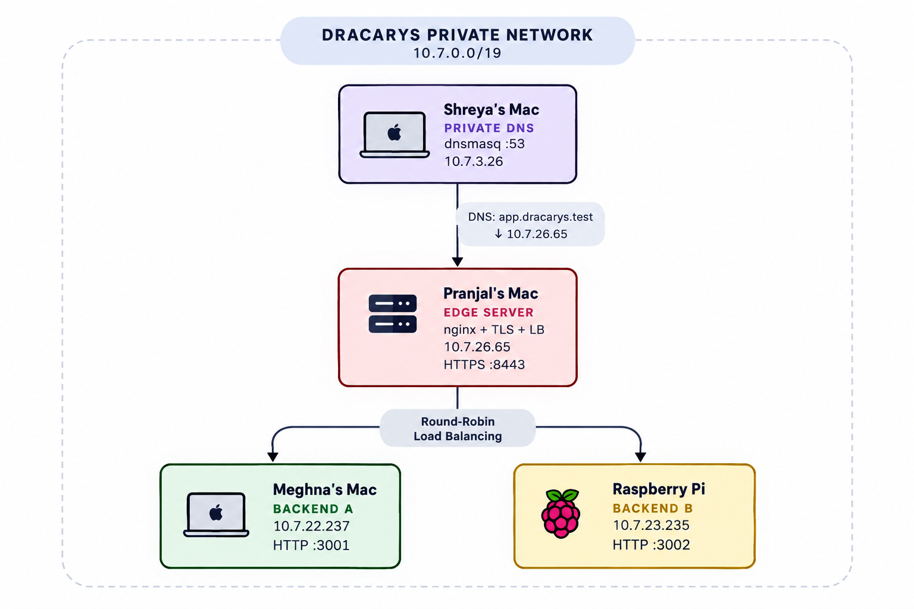
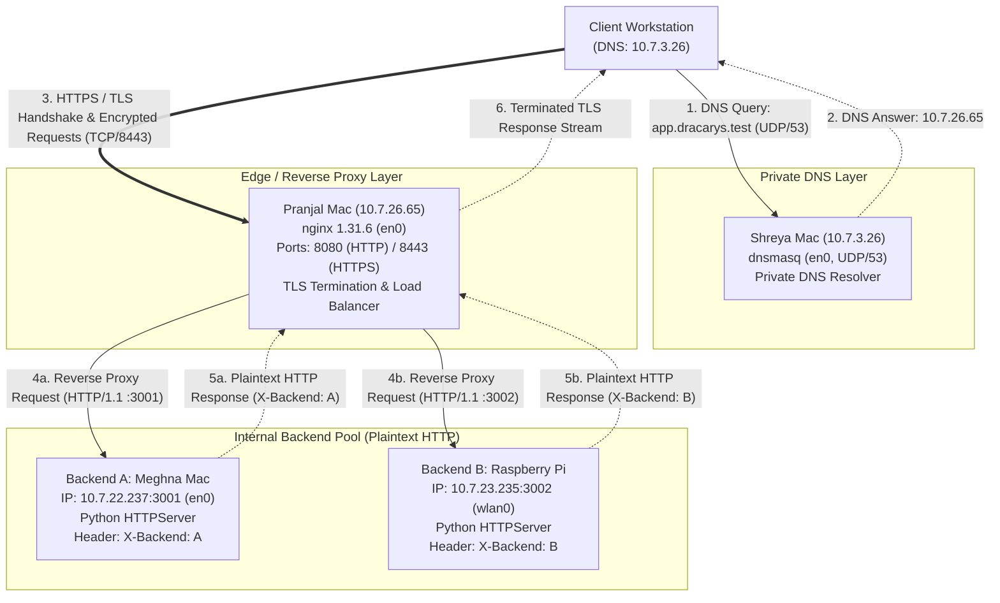

# System Architecture Document

**Project**: Private Network Service Platform  
**Team**: Dracarys  
**Phase**: Phase 1 Final Submission  

---

## 1. Project Overview

The **Private Network Service Platform** is a multi-tier private network infrastructure deployed across physical and heterogeneous hardware nodes on a local area network. The system demonstrates core computer networking principles across the link, network, transport, security, and application layers:
- **Private DNS Service**: Local domain resolution for `app.dracarys.test` provided by `dnsmasq` acting as a private DNS resolver configured with local static records.
- **Edge Reverse Proxy & TLS Termination**: An `nginx 1.31.6` instance providing client-to-edge TLS encryption (port 8443) and plaintext HTTP (port 8080) with a custom Public Key Infrastructure (PKI) local Certificate Authority.
- **Backend Abstraction & Load Balancing**: Upstream round-robin request distribution across heterogeneous application servers (macOS and Raspberry Pi Linux) with automated failover, completely abstracting backend network topology from the client.
- **HTTP Semantics & Three-State Caching**: RESTful endpoints supporting `GET` and `HEAD` methods, cache freshness via `Cache-Control: max-age=60`, and conditional revalidation via `ETag` and `If-None-Match` generating `304 Not Modified` responses.
- **Network Observability & Fault Tolerance**: Comprehensive packet capture analysis via Wireshark and verified resilience across five distinct failure scenarios.

---

## 2. Machine & Network Node Inventory (Task A Specifications)

All participating machines operate within a shared private IPv4 `/19` campus/LAN subnet with a default gateway at `10.7.0.1`.

- **Subnet Prefix**: `/19`
- **Subnet Netmask**: `255.255.224.0` (Host range: `10.7.0.1` – `10.7.31.254`)
- **Default Gateway**: `10.7.0.1`

| Node Role | Machine / Owner | Host OS / Device | IP Address | MAC Address | Interface | Port(s) | Service / Daemon | Configuration / Source Path |
| :--- | :--- | :--- | :--- | :--- | :--- | :--- | :--- | :--- |
| **Private DNS Server** | Shreya Mac | macOS | `10.7.3.26` | `a6:78:95:80:37:c7` | `en0` | UDP/53, TCP/53 | `dnsmasq` | `dns/dnsmasq.conf` |
| **Edge / Proxy / LB** | Pranjal Mac | macOS | `10.7.26.65` | `f6:82:34:12:8b:86` | `en0` | 8080 (HTTP), 8443 (HTTPS) | `nginx 1.31.6` | `nginx/nginx.conf` |
| **Backend A** | Meghna Mac | macOS | `10.7.22.237` | `10:9f:41:c0:45:7f` | `en0` | 3001 (HTTP) | Python 3 HTTPServer | `~/CN_Project/backend-a/server.py` |
| **Backend B** | Raspberry Pi | Raspberry Pi OS | `10.7.23.235` | `88:a2:9e:49:de:1d` | `wlan0` | 3002 (HTTP) | Python 3 HTTPServer | `~/CN_Project/backend-b/server.py` |

---

## 3. Pairwise Network Connectivity Matrix

Prior to service configuration, Layer 3 direct IP connectivity was verified across all participating nodes using ICMP echo requests (`ping -c 3 <destination_ip>`). All tests showed 100% transmission success and 0% packet loss:

| Source Node | Destination Node | Destination IP | Packets Transmitted | Packets Received | Packet Loss | Status |
| :--- | :--- | :--- | :--- | :--- | :--- | :--- |
| **Pranjal Mac** (`10.7.26.65`) | Shreya Mac | `10.7.3.26` | 3 | 3 | 0% | Verified |
| **Shreya Mac** (`10.7.3.26`) | Meghna Mac | `10.7.22.237` | 3 | 3 | 0% | Verified |
| **Shreya Mac** (`10.7.3.26`) | Raspberry Pi | `10.7.23.235` | 3 | 3 | 0% | Verified |
| **Pranjal Mac** (`10.7.26.65`) | Meghna Mac | `10.7.22.237` | 3 | 3 | 0% | Verified |
| **Pranjal Mac** (`10.7.26.65`) | Raspberry Pi | `10.7.23.235` | 3 | 3 | 0% | Verified |
| **Meghna Mac** (`10.7.22.237`) | Raspberry Pi | `10.7.23.235` | 3 | 3 | 0% | Verified |

Because all nodes share the `/19` prefix, communication occurs directly across the Layer 2 local link via ARP resolution without requiring inter-VLAN routing or NAT traversal.

---

## 4. Protocol Layer Mapping

The system utilizes protocols across the entire networking hierarchy. The table below maps each active protocol to both the **OSI 7-Layer Model** and the **TCP/IP 4-Layer Model**:

| Protocol / Technology | OSI Model Layer(s) | TCP/IP Model Layer | Implementation Details in Platform | Key Function & Addressing |
| :--- | :--- | :--- | :--- | :--- |
| **DNS** | Layer 7 (Application) | Application | `dnsmasq` listening on UDP/53 (and TCP/53) on `10.7.3.26` | Resolves `app.dracarys.test` to IP `10.7.26.65`. |
| **HTTP** | Layer 7 (Application) | Application | HTTP/1.1 requests (`GET`, `HEAD`) over TCP on edge (8080/8443) and backends (3001, 3002) | Application messaging, request routing, caching headers (`ETag`, `Cache-Control`), status codes. |
| **TLS** *(TLS 1.2 / TLS 1.3)* | Practical Security Sublayer *(spans Layer 4 Transport boundary to Layer 5/6 Session/Presentation)* | Practical Security Sublayer *(sits between Transport and Application)* | Negotiated between client and nginx edge on port 8443 | Provides client-to-edge cryptographic authentication, confidentiality, and data integrity. |
| **TCP** | Layer 4 (Transport) | Transport | TCP 3-way handshake (`SYN`, `SYN-ACK`, `ACK`), connection management on ports 8443, 8080, 3001, 3002 | Reliable, ordered, connection-oriented byte-stream delivery between endpoints. |
| **UDP** | Layer 4 (Transport) | Transport | UDP datagram exchange on port 53 | Low-latency, connectionless query/response transport for DNS. |
| **IP (IPv4)** | Layer 3 (Network) | Internet | IPv4 addressing within `10.7.0.0/19` subnet (gateway `10.7.0.1`) | Host-to-host packet addressing, routing, and delivery across nodes. |
| **Ethernet / Wi-Fi** | Layer 2 (Data Link) & Layer 1 (Physical) | Network Access (Link) | macOS `en0` (Gigabit Ethernet / Wi-Fi) and Raspberry Pi `wlan0` (802.11 Wi-Fi) | Framing, MAC addressing (e.g. ARP table resolution), and bit transmission across physical media. |

> [!NOTE]
> **Architectural Placement of TLS**: In practical networking, TLS is not a cleanly separated OSI layer; rather, it functions as a security sublayer positioned directly on top of the reliable TCP transport stream and beneath the HTTP application protocol. TLS encrypts the HTTP payload before TCP packetization occurs between the client and the edge proxy.

---

## 5. Architecture Diagram





---

## 6. DNS Architecture & Client Resolver Configuration

DNS resolution for the private domain is provided by `dnsmasq` running on Shreya's Mac (`10.7.3.26`).

### 6.1 Server Configuration
- **Configuration Path**: `dns/dnsmasq.conf`
- **Bound Addresses & Interfaces**:
  - `listen-address=127.0.0.1,10.7.3.26`
  - `interface=en0`
- **Local Static Records**:
  - `address=/app.dracarys.test/10.7.26.65`
  - `address=/api.dracarys.test/10.7.26.65`
- **Technical Operation**: Rather than maintaining zone transfer files like BIND, `dnsmasq` acts as a lightweight private DNS resolver that intercepts requests matching configured domain rules and serves local static IP mappings immediately with a configured TTL of 0.

### 6.2 Client-Side Resolver Configuration
To direct DNS traffic to Shreya's node:
- Participating client machines (Pranjal Mac, Meghna Mac) configured their primary network interface (`en0` / Wi-Fi) DNS resolver to `10.7.3.26`.
- Verified using `dig`:
  ```bash
  # Query private DNS resolver directly
  dig @10.7.3.26 app.dracarys.test

  # Standard resolution using configured system resolver
  dig app.dracarys.test
  ```
- Contrast with public DNS resolvers (e.g. `dig @8.8.8.8 app.dracarys.test`), which reliably return `NXDOMAIN` because `.test` is an RFC 2606 reserved top-level domain that does not exist in the global DNS root hierarchy.

---

## 7. Hostname & TLS Certificate Scope Note

The DNS configuration contains mappings for two hostnames:
1. `app.dracarys.test -> 10.7.26.65`
2. `api.dracarys.test -> 10.7.26.65`

However, our current server TLS certificate Subject Alternative Name (SAN) covers **only**:
- `SAN: DNS:app.dracarys.test`

Consequently:
- **`app.dracarys.test`** is the primary, demonstrated HTTPS hostname with valid, trusted TLS termination.
- **`api.dracarys.test`** resolves to the edge IP in DNS, but connecting to `https://api.dracarys.test:8443` would result in a TLS hostname/SAN mismatch error. It does **not** have a trusted HTTPS certificate in this Phase 1 deployment.

---

## 8. DNS Resolution vs. TCP/HTTPS Connection

A fundamental networking principle demonstrated during this project is the strict operational decoupling between **Name Resolution** and **Transport/Application Connectivity**:

1. **DNS is strictly an Address Mapping Service**:
   - `dig app.dracarys.test` queries `10.7.3.26:53` via UDP.
   - The DNS response returns only the mapping `10.7.26.65`.
   - **Crucial Concept**: Successful DNS resolution does **not** prove that the web service, edge proxy, or backend servers are reachable, online, or listening on any port.
2. **Independent TCP Handshake**:
   - Only after obtaining `10.7.26.65` does the client OS initiate a TCP 3-way handshake (`SYN` -> `SYN-ACK` -> `ACK`) directed to `10.7.26.65:8443`.
3. **Layered TLS Establishment & Application Transmission**:
   - Once the TCP connection is established, the TLS handshake executes across the open TCP socket.
   - Only after successful TLS authentication and cipher negotiation are HTTPS application data frames (`GET /api/status HTTP/1.1`) transmitted.

### Failure Demonstration Insights
This architectural layer independence explains our empirical failure testing outcomes (documented in [failure-tests.md](failure-tests.md)):
- **DNS Success with Transport Failure (Scenario 2 & Scenario 5)**:
  - When DNS pointed to unreachable IP `192.0.2.123` (Scenario 2), DNS resolution succeeded instantaneously (`A 192.0.2.123`), but the subsequent TCP SYN timed out.
  - When requests targeted unbound port `8444` (Scenario 5), DNS resolution succeeded instantaneously, but the TCP handshake was immediately rejected with a TCP `RST`.
- **IP Reachability with DNS Failure (Scenario 1)**:
  - When client DNS was pointed to `192.0.2.53`, `dig app.dracarys.test` timed out completely.
  - However, direct IP communication (`ping -c 3 10.7.26.65`) succeeded with 0% packet loss, proving that IP routing remained fully operational despite DNS failure.

---

## 9. Edge Reverse Proxy & Backend Abstraction

The edge tier is powered by `nginx 1.31.6` on Pranjal's Mac (`10.7.26.65`).

### 9.1 The Role of Backend Abstraction
A core advantage of this reverse-proxy architecture is **complete backend abstraction**:
- **Information Hiding**: The client workstation is only ever aware of the edge domain `app.dracarys.test` and the edge proxy IP `10.7.26.65`.
- **Isolation**: The client does not know, reach, or require the private IP addresses of the application servers (`10.7.22.237` or `10.7.23.235`).
- **Topology Flexibility**: The backend server pool can scale, reboot, change IP addresses, or experience individual node failures without requiring any configuration changes, cache invalidation, or URL updates on client devices.

### 9.2 Request Enrichment & Header Forwarding
Nginx terminates client HTTPS connections and forwards requests to the upstream pool:
```nginx
location / {
    proxy_pass http://backend_pool;
    proxy_set_header Host $host;
    proxy_set_header X-Real-IP $remote_addr;
    proxy_set_header X-Forwarded-For $proxy_add_x_forwarded_for;
}
```
This ensures backend application logs capture the real client IP rather than the proxy loopback.

---

## 10. nginx Load Balancing & Upstream Failover

### 10.1 Equal-Weight Round-Robin Distribution
Nginx defines an upstream server pool:
```nginx
upstream backend_pool {
    server 10.7.22.237:3001;
    server 10.7.23.235:3002;
}
```
In default round-robin mode (`weight=1`), requests alternate equally:
- Request 1: Routed to Backend A (`10.7.22.237:3001`) -> returns `X-Backend: A`
- Request 2: Routed to Backend B (`10.7.23.235:3002`) -> returns `X-Backend: B`
- Request 3: Cycles back to Backend A, and so on.

### 10.2 Automated Upstream Failover
If an upstream node fails (e.g. Backend B process terminates), nginx detects the upstream connection failure and automatically retries the pending request on the remaining healthy upstream member (`Backend A`) via standard `proxy_next_upstream` mechanisms. Demonstrated requests continued returning HTTP 200 from Backend A while Backend B was unavailable.

---

## 11. Backend Application Architecture

The application tier consists of two independent HTTP servers built using Python's standard library (`http.server.HTTPServer` and `BaseHTTPRequestHandler`):
- **Backend A** (`backend-a/server.py`):
  - Running on Meghna Mac (`10.7.22.237:3001`).
  - Identifies itself via HTTP header `X-Backend: A`.
- **Backend B** (`backend-b/server.py`):
  - Running on Raspberry Pi (`10.7.23.235:3002`, interface `wlan0`).
  - Identifies itself via HTTP header `X-Backend: B`.

### Endpoints Implemented
1. `GET /`:
   - Returns HTTP `200 OK` with JSON greeting and backend identifier (`{"message": "Private Network Service", "backend": "A"}`).
2. `GET /api/status`:
   - Returns HTTP `200 OK` with JSON status payload (`{"backend": "A", "status": "ok"}`).
   - Emits caching headers: `ETag: "dracarys-v1"` and `Cache-Control: max-age=60`.
3. `HEAD /` and `HEAD /api/status`:
   - Returns identical response headers (`X-Backend`, `ETag`, `Cache-Control`, `Content-Type`) without transmitting a response body.
4. Unmapped Paths:
   - Returns HTTP `404 Not Found` with structured JSON error payload.

---

## 12. TLS Architecture & Client Trust Model

### 12.1 Local CA PKI Design
To provide authentic cryptographic security on private domain `.test` without using invalid self-signed browser exceptions:
- **Root Authority**: Created internal root CA titled **Dracarys Local CA**.
- **Server Certificate**: Issued leaf certificate with `CN=app.dracarys.test` and `SAN=DNS:app.dracarys.test`.
- **Edge Deployment**: Stored on Pranjal Mac at `/usr/local/etc/nginx/certs/app.dracarys.test.crt` and `.key`.
- **Trust Distribution**: The root CA certificate was imported into the macOS Keychain (`System` keychain) and marked as "Always Trust" across participating Macs (Pranjal Mac, Meghna Mac, and Shreya Mac).

### 12.2 Verification Without `-k` Flag
Because the root CA is trusted in the operating system keychain:
```bash
curl -v https://app.dracarys.test:8443/api/status
```
Execution logs confirm:
- `SSL certificate verify ok`
- Valid cryptographic trust chain established to `Dracarys Local CA`
- Standard HTTPS requests succeed without `--insecure` or `-k`.

### 12.3 Wireshark TLS Capture Command
For formal Wireshark packet capture analysis, the test was executed specifying TLS 1.2:
```bash
curl --tls-max 1.2 -v https://app.dracarys.test:8443/api/status
```
> [!NOTE]
> **Rationale for `--tls-max 1.2` in Packet Captures**:
> In TLS 1.3, intermediate handshake messages (such as the server certificate and handshake extensions) are encrypted by default. TLS 1.2 was deliberately selected for the Wireshark evidence capture so that every discrete cryptographic stage—`ClientHello`, `ServerHello`, `Certificate`, `ServerKeyExchange`, `ClientKeyExchange`, and `ChangeCipherSpec`—was clearly visible for packet inspection. The nginx edge server itself accepts both **TLSv1.2** and **TLSv1.3**.

### 12.4 Client-to-Edge TLS vs. Internal Backend Proxying
In this architecture, TLS terminates at the nginx edge proxy:
```text
[ Client ] <==== TLS / HTTPS Encrypted ====> [ nginx Edge Proxy ] <---- Plaintext HTTP ----> [ Backend A / B ]
```
- **Client-to-Edge TLS Encryption**: Traffic traveling across the client-to-proxy segment is fully encrypted, safeguarding credentials, tokens, and data from passive LAN eavesdropping.
- **Internal Backend Communication**: Requests between nginx and the backend pool travel as plaintext HTTP over the internal `/19` private subnet.
- **Terminology**: This deployment features **client-to-edge TLS encryption** (edge termination), not end-to-end encryption between the client and the backend nodes.

---

## 13. HTTP Caching & Three-State Semantics

Both backend application servers implement RFC 7234 (HTTP Caching) and RFC 7232 (Conditional Requests) headers on `/api/status`. The platform demonstrates the three canonical caching states:

### State 1: Fresh Cache Hit
- When a client or intermediary cache first receives a response with `Cache-Control: max-age=60`, the representation is considered **fresh** for 60 seconds from generation.
- During this 60-second window, an RFC-compliant caching user agent (such as a browser or caching proxy) can satisfy identical requests directly from its local cache without making any network request to the origin server.

### State 2: Conditional Revalidation Request (`304 Not Modified`)
- Once the 60-second freshness lifetime expires (or when validating cached content), the client issues a **conditional request** by attaching the validator header:
  ```http
  If-None-Match: "dracarys-v1"
  ```
- The backend evaluates the received header against its current resource representation:
  - Since the entity tag matches, the resource is unchanged.
  - The server halts further response serialization and immediately responds with:
    ```http
    HTTP/1.1 304 Not Modified
    Server: nginx/1.31.6
    ETag: "dracarys-v1"
    Cache-Control: max-age=60
    X-Backend: A
    ```
  - **Crucial Observation**: No response body is sent. This validates cached content while eliminating payload transmission overhead.

### State 3: Full Request / Response (`200 OK`)
- If the client has no stored representation (an initial cold request), or if the resource representation changes (yielding an ETag mismatch), the server generates the full payload:
  - HTTP Status: `200 OK`
  - Headers: `ETag: "dracarys-v1"`, `Cache-Control: max-age=60`, `Content-Type: application/json`
  - Body: Complete JSON payload `{"backend": "A", "status": "ok"}`.

> [!NOTE]
> **HTTP Semantics vs. Tool Behavior**: Command-line `curl` is a protocol inspection and transfer tool that does not maintain an automatic persistent cache between standalone shell executions. The caching states described above reflect the RFC HTTP/1.1 specification implemented by the servers and validated via explicit headers (`If-None-Match`), rather than automatic client caching by curl.

---

## 14. Conceptual Cloud Service Equivalents

The entire Phase 1 system is deployed locally on physical private nodes. For enterprise context, the table below maps each local component to its conceptual equivalent in public cloud environments:

| Phase 1 Local Component | Conceptual Cloud Equivalent | Cloud Provider Examples | Shared Architectural Role |
| :--- | :--- | :--- | :--- |
| **`dnsmasq` Private DNS** | Managed Private DNS / Private Hosted Zone | AWS Route 53 Private Hosted Zones, GCP Cloud DNS (Private), Azure Private DNS | Resolves internal, non-public domains within a virtual network. |
| **`nginx` Reverse Proxy & Load Balancer** | Managed Application Load Balancer (ALB) | AWS Application Load Balancer (ALB), Google Cloud Application Load Balancer, Azure Application Gateway | Layer 7 request routing, path-based routing, health checking, and backend distribution. |
| **Local CA & TLS Termination** | Cloud Certificate Manager & Edge TLS Termination | AWS Certificate Manager (ACM) + ALB Listener, Cloudflare Edge SSL | Terminates incoming TLS sessions at the edge proxy using managed digital certificates. |
| **Python Application Backends** | Compute Instances / Containers / Serverless | AWS EC2 / ECS / Fargate, Google Compute Engine / Cloud Run | Executes application code and generates dynamic API responses. |
| **`Cache-Control` / `ETag` Headers** | Content Delivery Network (CDN) & Edge Caching | Amazon CloudFront, Cloudflare CDN, Fastly | Evaluates freshness lifetimes and handles 304 conditional revalidations at intermediate caches. |

*Disclaimer: These mappings are conceptual comparisons illustrating production equivalents; all Phase 1 services run strictly on physical LAN hardware.*

---

## 15. HTTP/2 and HTTP/3 Protocol Context

Our demonstrated Phase 1 platform operates using **HTTP/1.1 over TLS 1.2 / TLS 1.3**:
- **Sufficiency of HTTP/1.1**: HTTP/1.1 with persistent connections (`Keep-Alive`), pipelining capabilities, and standard caching headers fully satisfies all requirements of our private platform.
- **HTTP/2 Context**: HTTP/2 introduces binary framing and stream multiplexing across a single TCP connection, allowing multiple concurrent requests and responses without head-of-line blocking at the application layer, alongside HPACK header compression.
- **HTTP/3 Context**: HTTP/3 replaces TCP with QUIC over UDP. By handling stream multiplexing and connection migration at the transport layer, QUIC eliminates TCP head-of-line packet blocking and integrates TLS 1.3 encryption directly into the initial transport handshake.
- **Implementation Scope**: Our Phase 1 platform does **not** implement or depend on HTTP/2 or HTTP/3; it focuses cleanly on foundational HTTP/1.1 and TLS semantics.

---

## 16. Request Flow Trace

Below is the complete sequence of network operations executed when a client performs a request:

```bash
curl -v https://app.dracarys.test:8443/api/status
```

1. **DNS Query**: Client OS sends UDP datagram to `10.7.3.26:53` querying `A app.dracarys.test`.
2. **DNS Response**: `dnsmasq` returns `A 10.7.26.65` with TTL 0.
3. **TCP 3-Way Handshake**:
   - Client sends TCP `SYN` to `10.7.26.65:8443`.
   - Nginx responds with `SYN, ACK`.
   - Client acknowledges with `ACK`.
4. **TLS Handshake**:
   - Client sends `ClientHello` (with SNI `app.dracarys.test`).
   - Nginx responds with `ServerHello`, presents `app.dracarys.test.crt` (issued by Dracarys Local CA), and completes ECDHE key exchange.
   - Client verifies the certificate against the trusted Dracarys Local CA in its system keychain.
   - Both endpoints exchange `ChangeCipherSpec` and derive symmetric encryption keys.
5. **Encrypted HTTP Forwarding**:
   - Client sends encrypted HTTP request `GET /api/status HTTP/1.1`.
   - Nginx decrypts the TLS record and evaluates upstream `backend_pool`.
   - Via round-robin, nginx selects Backend A (`10.7.22.237:3001`) or Backend B (`10.7.23.235:3002`).
6. **Backend Processing & Response**:
   - The selected backend processes the request over the internal subnet and returns a plaintext HTTP response containing `X-Backend`, `ETag`, `Cache-Control`, and JSON body.
7. **Client Delivery**:
   - Nginx encrypts the HTTP response into TLS application data records and sends them across port 8443.
   - Client decrypts and outputs the final response payload.

---

## 17. Failure Demonstrations Summary

A comprehensive failure matrix was executed across all layers to validate resilience. Detailed test traces and output logs are maintained in [failure-tests.md](failure-tests.md):

1. **Wrong DNS Server**: Client resolver set to `192.0.2.53`. `dig` timed out after 2s; direct IP ping to edge host (`10.7.26.65`) succeeded with 0% loss, proving layer decoupling.
2. **Wrong DNS Record**: Record altered to `192.0.2.123`. DNS resolved immediately, but subsequent TCP SYN to port 8443 timed out.
3. **One Backend Down (Formal D3 Scenario)**: Backend B stopped on Raspberry Pi. Nginx automatically routed 100% of traffic to Backend A with zero client-visible errors. Service resumed alternating upon restart.
4. **Both Backends Down**: Backend A and Backend B stopped. Nginx returned clean `502 Bad Gateway`.
5. **Wrong Destination Port**: Requests directed to unbound port `8444`. Host OS immediately rejected TCP SYN with a TCP `RST` (`Connection refused`).

---

## 18. Evidence Collected During Phase 1

The team gathered and verified empirical artifacts during the live demonstration:

1. **Machine & Network Inventory**: Documented IP addresses, MAC addresses, interfaces, and gateway.
2. **Pairwise Ping Results**: Pairwise ping validation across participating hosts confirming 0% packet loss in the demonstrated tests.
3. **Private DNS `dig` Output**: Verified resolution of `app.dracarys.test` to `10.7.26.65`.
4. **Trusted HTTPS `curl` Verification**: Validated TLS verification without `-k` / `--insecure`.
5. **Round-Robin Load Balancing Logs**: Terminal traces demonstrating equal `A -> B -> A -> B` alternation.
6. **Caching Headers & `304 Not Modified` Traces**: Validated `Cache-Control: max-age=60`, `ETag`, and `If-None-Match` revalidation.
7. **Wireshark DNS Capture**: UDP port 53 query and response transaction records.
8. **Wireshark TCP Handshake Capture**: Three-way handshake (`SYN`, `SYN-ACK`, `ACK`) on port 8443.
9. **Wireshark TLS Handshake Capture**: Full TLS 1.2 negotiation exchange records.
10. **Encrypted TLS Application Data Capture**: Verified that HTTP application data is fully encrypted on the wire.
11. **Five Resilience Demonstrations**: Execution logs for all injected failure scenarios.

> [!NOTE]
> Detailed descriptions of all capture files are documented in [evidence/README.md](../evidence/README.md). In accordance with repository policies, binary capture files (`.pcapng`) and terminal logs are stored locally and must be added separately if tracked in GitHub.
